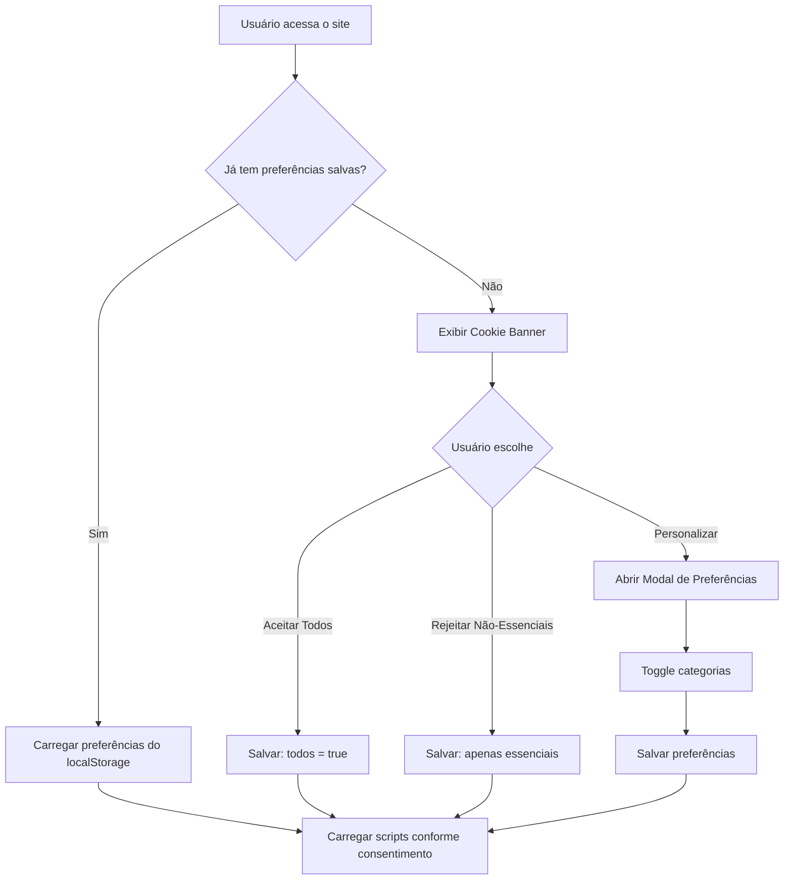

# Plano de Implementação: Conformidade com Política de Privacidade LGPD

## ✅ Status: IMPLEMENTADO

Este plano documenta as features implementadas para que o site **Riaheru Ventures** esteja em conformidade com a **Política de Privacidade** da empresa, seguindo os requisitos da **LGPD**.

> [!NOTE]
> **Escopo Atualizado**: Conforme feedback, o documento Word de política de privacidade foi mantido como está. Não houveram páginas separadas para Termos de Uso ou Direitos LGPD.

---

## Proposed Changes

### Componente 1: Cookie Consent Banner

#### [NEW] [CookieConsent.tsx](file:///c:/Users/ricky/OneDrive/Área%20de%20Trabalho/Riaheru/src/components/CookieConsent/CookieConsent.tsx)

Banner de consentimento de cookies com:
- Aparição na primeira visita
- Categorias de cookies:
  - **Essenciais** (sempre ativos, não podem ser desabilitados)
  - **Funcionais** (preferências, sessão)
  - **Marketing/Analytics** (Google Analytics, etc.)
- Botões: "Aceitar Todos", "Rejeitar Não-Essenciais", "Personalizar"
- Persistência no localStorage
- Link para download da política de privacidade

#### [NEW] [CookieSettings.tsx](file:///c:/Users/ricky/OneDrive/Área%20de%20Trabalho/Riaheru/src/components/CookieConsent/CookieSettings.tsx)

Modal de preferências detalhadas com toggle para cada categoria.

#### [NEW] [useCookieConsent.ts](file:///c:/Users/ricky/OneDrive/Área%20de%20Trabalho/Riaheru/src/hooks/useCookieConsent.ts)

Hook React para gerenciar estado de consentimento.

---

### Componente 2: Formulário de Contato (ContactModal)

#### [MODIFY] [ContactModal.tsx](file:///c:/Users/ricky/OneDrive/Área%20de%20Trabalho/Riaheru/src/components/ContactModal/ContactModal.tsx)

Adicionar:
1. **Checkbox de consentimento** obrigatório antes do envio:
   ```text
   ☐ Li e concordo com a Política de Privacidade e autorizo o tratamento dos meus dados pessoais para fins de contato comercial.
   ```
2. **Campos opcionais** (conforme política):
   - Empresa (opcional)
   - Cargo (opcional)
   - Telefone (opcional)
3. **Link para download** da política de privacidade

---

### Componente 3: Atualização do Footer

#### [MODIFY] [Footer.tsx](file:///c:/Users/ricky/OneDrive/Área%20de%20Trabalho/Riaheru/src/components/Footer/Footer.tsx)

Atualizar seção `legal` do footer:
```typescript
legal: [
    { name: 'Privacidade', href: '/Politica-de-Privacidade-Riaheru-Ventures TESTE.docx' },
    { name: 'Cookies', href: '#cookies' },  // abre modal de preferências
],
```

---

### Componente 4: Integração no App

#### [MODIFY] [App.tsx](file:///c:/Users/ricky/OneDrive/Área%20de%20Trabalho/Riaheru/src/App.tsx)

Adicionar componente CookieConsent no layout principal.

---

### Componente 5: Testes Automatizados

#### [NEW] [e2e/cookies.spec.ts](file:///c:/Users/ricky/OneDrive/Área%20de%20Trabalho/Riaheru/e2e/cookies.spec.ts)

Testes E2E com Playwright:
```typescript
import { test, expect } from '@playwright/test';

test.describe('Cookie Consent', () => {
  test('banner aparece na primeira visita', async ({ page }) => {
    await page.goto('/');
    await expect(page.locator('[data-testid="cookie-banner"]')).toBeVisible();
  });

  test('banner desaparece após aceitar', async ({ page }) => {
    await page.goto('/');
    await page.click('[data-testid="accept-all-cookies"]');
    await expect(page.locator('[data-testid="cookie-banner"]')).not.toBeVisible();
  });

  test('preferências são salvas', async ({ page }) => {
    await page.goto('/');
    await page.click('[data-testid="accept-all-cookies"]');
    await page.reload();
    await expect(page.locator('[data-testid="cookie-banner"]')).not.toBeVisible();
  });
});
```

#### [NEW] [e2e/contact.spec.ts](file:///c:/Users/ricky/OneDrive/Área%20de%20Trabalho/Riaheru/e2e/contact.spec.ts)

Testes do formulário de contato:
```typescript
import { test, expect } from '@playwright/test';

test.describe('Contact Modal', () => {
  test('formulário requer consentimento', async ({ page }) => {
    await page.goto('/');
    // Aceitar cookies primeiro
    await page.click('[data-testid="accept-all-cookies"]');
    // Abrir modal de contato
    await page.click('[data-testid="contact-button"]');
    // Preencher campos
    await page.fill('[name="nome"]', 'Teste');
    await page.fill('[name="email"]', 'teste@teste.com');
    await page.fill('[name="mensagem"]', 'Mensagem de teste');
    // Tentar enviar sem checkbox
    await page.click('button[type="submit"]');
    // Deve mostrar erro
    await expect(page.locator('[data-testid="consent-error"]')).toBeVisible();
  });

  test('formulário envia com consentimento', async ({ page }) => {
    await page.goto('/');
    await page.click('[data-testid="accept-all-cookies"]');
    await page.click('[data-testid="contact-button"]');
    await page.fill('[name="nome"]', 'Teste');
    await page.fill('[name="email"]', 'teste@teste.com');
    await page.fill('[name="mensagem"]', 'Mensagem de teste');
    // Marcar checkbox
    await page.check('[data-testid="privacy-consent"]');
    // Submit deve funcionar
    await page.click('button[type="submit"]');
  });
});
```

#### [NEW] [playwright.config.ts](file:///c:/Users/ricky/OneDrive/Área%20de%20Trabalho/Riaheru/playwright.config.ts)

Configuração do Playwright para testes E2E.

---

## Diagrama de Fluxo: Cookie Consent



---

## Verification Plan

### Testes Automatizados (Playwright)

| Cenário | Arquivo | Descrição |
|---------|---------|-----------|
| Cookie Banner visível | `e2e/cookies.spec.ts` | Verifica aparição na primeira visita |
| Aceitar cookies | `e2e/cookies.spec.ts` | Banner some após aceitar |
| Persistência | `e2e/cookies.spec.ts` | Preferências mantidas após reload |
| Formulário sem consentimento | `e2e/contact.spec.ts` | Erro exibido se checkbox não marcado |
| Formulário com consentimento | `e2e/contact.spec.ts` | Submit funciona com checkbox marcado |

### Comandos de Teste

```bash
# Instalar Playwright
pnpm add -D @playwright/test
npx playwright install

# Rodar testes
pnpm exec playwright test

# Rodar testes com UI
pnpm exec playwright test --ui
```

---

## Cronograma Sugerido

| Fase | Componentes | Estimativa |
|------|-------------|------------|
| 1 | Cookie Consent Banner + Hook | 2-3 horas |
| 2 | ContactModal + Checkbox | 1 hora |
| 3 | Footer atualização | 15 min |
| 4 | Configuração Playwright | 30 min |
| 5 | Testes E2E | 1-2 horas |
| **Total** | | **5-7 horas** |

---

## Arquivos a Serem Criados/Modificados

### Novos Arquivos
- `src/components/CookieConsent/CookieConsent.tsx`
- `src/components/CookieConsent/CookieSettings.tsx`
- `src/hooks/useCookieConsent.ts`
- `e2e/cookies.spec.ts`
- `e2e/contact.spec.ts`
- `playwright.config.ts`

### Arquivos Modificados
- `src/App.tsx` - Adicionar CookieConsent
- `src/components/Footer/Footer.tsx` - Links legais
- `src/components/ContactModal/ContactModal.tsx` - Checkbox + campos opcionais
- `src/components/index.ts` - Export CookieConsent
- `package.json` - Adicionar Playwright como dev dependency
